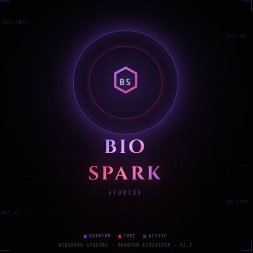

<div align="center">



# Quantum Loom

**A narrative DAW for story, music & world-building**

*Remix stories like music. Compose worlds like instruments.*

[](https://github.com/BioSpark-Studios/quantum-loom/releases)
[](https://github.com/BioSpark-Studios/quantum-loom/releases)
[](https://electronjs.org)
[](LICENSE)

</div>

---

<!-- HERO SCREENSHOT — replace with your actual banner image -->
<!-- <div align="center"></div> -->

## What is Quantum Loom?

Quantum Loom is a creative operating system for storytelling. Where traditional writing tools force you to work linearly — page one to page end — Quantum Loom treats narrative the way a producer treats music.

> **Characters are instruments. Scenes are arrangement blocks. Emotional arcs are automation lanes. The whole story is a project you sequence, remix, and export in any format you need.**

Built across nine specialized layers, Loom gives writers, educators, and world-builders a single place to:

- Author characters with emotional vectors and trait graphs
- Design zones, locations, and biome regions
- Sequence narrative arcs across chapters
- Wire everything together through a live signal graph
- Drive 3D environments, game engines, and AI agents in real time

When you're ready, the **Output Renderer** compiles your work into professional formats in one click.

---

## Features

### Nine-Layer Narrative Workspace

| Layer | Description |
|---|---|
| **Characters** | Emotional vectors, trait graphs, faction relationships |
| **Library** | Assets, archetypes, reference material |
| **Zones** | Locations, biome regions, spatial logic |
| **Scenes** | Arrangement blocks, chapter sequencing |
| **Instrument Rack** | MIDI-driven narrative controllers with live signal bus |
| **Sequencer** | Timeline, arc automation, beat-mapped events |
| **Node Graph** | Wire characters, events, and conditions into flow logic |
| **Atlas** | Terrain, environment, lighting, civilization world-builder |
| **Output** | One-click multi-format export |

### Six Export Formats

- 📖 Novel chapter
- 🎬 Screenplay
- 🎵 Song / lyrics
- 🌍 World Bible
- 🎮 Game script
- 📋 Session sheet

### AI Draft Mode

Stream prose directly from your choice of AI provider:

**Ollama** (local) · **Claude** · **Gemini** · **OpenAI** · **Azure OpenAI**

---

<!-- FEATURE SCREENSHOTS — add 2–3 side-by-side or stacked -->
<!--
<div align="center">
  
  
</div>
<div align="center">
  
</div>
-->

---

## Quantum Atlas

Quantum Atlas is the world-building engine built into Loom — a cascading pipeline of interconnected modules that generate and modulate the physical and social fabric of your world.

```
Terrain → Environment → Architect → Lighting → Civilization → Bridge → Network
```

Atlas data flows downstream automatically. Change the terrain and the civilization adapts. Each module exports to the Loom signal bus, driving the instrument rack, node graphs, and live 3D environments in real time.

---

## Instrument Rack

The rack is a MIDI-enabled narrative controller — think of it as a synthesizer for story state.

- **MIDI In/Out** — full Web MIDI API, works with any hardware controller
- **CC Learn** — click Learn on any control, wiggle a knob on your hardware, assigned
- **3 Rack Modes:**
  - `CONTROLLER` — rack sends CC to external gear on every control change
  - `SYNTH` — incoming MIDI fires narrative events into the signal bus
  - `NARRATIVE WEAVER` — Atlas data modulates rack parameters in real time
- **Back panel** — Reason-style patch bay with cable routing
- **Signal bus** — live state broadcast via `ql-signal-bus` for R3F / game engine integration

---

## Installation

### Download (recommended)

Grab the latest installer from the [Releases page](https://github.com/BioSpark-Studios/quantum-loom/releases):

| Platform | File |
|---|---|
| **Windows** | `Quantum-Loom-Setup-x64.exe` |
| **macOS** | `Quantum-Loom.dmg` |
| **Linux** | `Quantum-Loom.AppImage` or `quantum-loom_amd64.deb` |

### Run from source

```bash
git clone https://github.com/BioSpark-Studios/quantum-loom.git
cd quantum-loom
npm install
npm start
```

Requires [Node.js 18+](https://nodejs.org) and [Git](https://git-scm.com).

---

## Build

```bash
# Development (opens DevTools)
npm run dev

# Production builds
npm run build:win      # Windows NSIS installer (x64 + arm64)
npm run build:mac      # macOS DMG (x64 + arm64) — must run on macOS
npm run build:linux    # Linux AppImage + .deb (x64)
npm run build:all      # All platforms
```

> **macOS note:** Building the Mac DMG requires running on macOS with Xcode command-line tools installed.

---

## Tech Stack

| | |
|---|---|
| **Shell** | Electron 33 |
| **UI** | Vanilla HTML/CSS/JS — no framework, no build step |
| **AI** | Anthropic SDK, Ollama, Gemini, OpenAI |
| **Storage** | localStorage + native .loom project files |
| **Signals** | Web MIDI API, socket.io event bus |
| **Icons** | Google Fonts (Orbitron, Space Grotesk, JetBrains Mono) |

---

## About

Built by **[BioSpark Studios](https://biospark.studio)** as part of the **Quantum Ecosystem** — a modular world-building platform where every creative tool speaks the same language.

Quantum Loom is designed for writers, educators, game designers, musicians, and anyone who thinks in systems.

---

<div align="center">

*Quantum Loom — where narrative meets signal.*

**[Download](https://github.com/BioSpark-Studios/quantum-loom/releases)** · **[Issues](https://github.com/BioSpark-Studios/quantum-loom/issues)**

</div>
